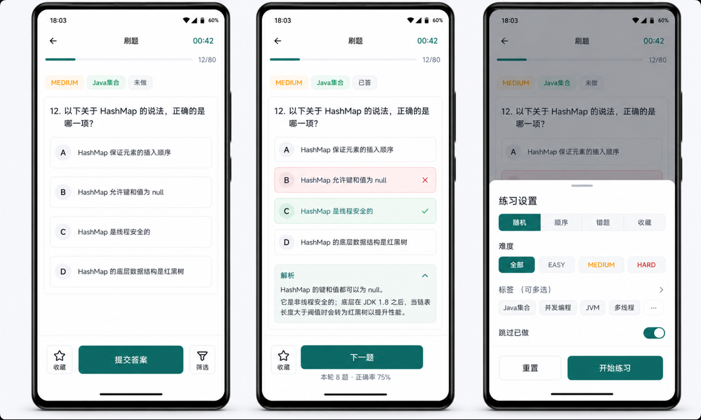
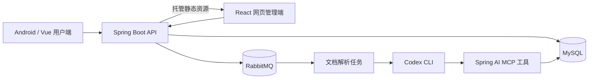

# Java 面试刷题平台

一个面向 Java 开发者的面试刷题平台，包含 Vue 用户端、React 网页管理端、Spring Boot 后端和原生 Android WebView 客户端。管理员可以从 App 或浏览器上传知识文档，并通过 Codex CLI 自动生成、校验和入库单选题；普通用户可以按标签、难度和练习模式刷题，并使用错题本、收藏和学习统计功能。



## 主要功能

| 模块 | 功能 |
| --- | --- |
| 用户与权限 | 邮箱验证码登录、JWT 鉴权、普通用户与管理员角色、登录失败限制 |
| 题库 | 单选题、难度与标签、随机或顺序练习、按条件筛选、题目上下线 |
| 学习闭环 | 答题解析、错题本、收藏、已答题记录、App 个人屏蔽、每日与标签统计 |
| 文档导入 | Markdown/ZIP 上传、解析任务队列、任务状态与执行日志、失败重试 |
| AI 产题 | Codex CLI 读取知识文档、联网补充资料、自我审查，并通过 MCP 工具写入题库 |
| React 管理端 | 后端托管的浏览器控制台，支持上传、文档、任务、日志和题库管理 |
| Android | 内置 Vue 静态资源的 WebView 客户端、文件选择、后端地址配置和 APK 更新 |

## 系统结构



## 技术栈

- 后端：Java 21、Spring Boot 3.5、Spring Security、Spring Data JPA、Spring AI MCP、RabbitMQ、MySQL。
- 用户前端：Vue 3、Vite 8、Markdown-It、Lucide Vue。
- 网页管理端：React 19、Vite 7、React Markdown，由 Spring Boot 构建并托管。
- Android：Java、Android WebView、AndroidX WebKit，`minSdk 26`、`targetSdk 36`。
- 测试与构建：JUnit 5、H2、Maven、Gradle 8.13、GraalVM Native Image。

## 项目目录

```text
.
├── android/     # 原生 Android WebView 客户端
├── admin-web/   # React 网页管理控制台
├── backend/     # Spring Boot API、MCP 服务和自动化测试
├── docs/        # 按功能拆分的产品与实现文档
├── frontend/    # Vue/Vite 多页面前端
├── images/      # README 与界面预览资源
└── scripts/     # 后端启动、Android 发布等辅助脚本
```

## 本地开发

### 环境要求

- JDK 21 和 Maven。
- Node.js `^20.19.0` 或 `>=22.12.0`，以及 npm。
- MySQL 8.x。
- 完整体验文档导入功能时，需要 RabbitMQ 和已登录的 Codex CLI。
- 构建 Android 客户端时，需要 Android SDK 36、Gradle 8.13 和 ADB。

### 1. 获取代码

```bash
git clone https://github.com/naledao/coding-interview-practice-platform.git
cd coding-interview-practice-platform
```

### 2. 配置后端

先创建数据库：

```sql
CREATE DATABASE coding_interview_practice_platform
  CHARACTER SET utf8mb4
  COLLATE utf8mb4_unicode_ci;
```

通过环境变量提供连接信息和密钥。下面的值均为示例占位符：

```bash
export MYSQL_URL='jdbc:mysql://127.0.0.1:3306/coding_interview_practice_platform?useUnicode=true&characterEncoding=utf-8&serverTimezone=Asia/Shanghai'
export MYSQL_USERNAME='your-mysql-user'
export MYSQL_PASSWORD='your-mysql-password'

export RABBITMQ_HOST='127.0.0.1'
export RABBITMQ_PORT='5672'
export RABBITMQ_USERNAME='your-rabbitmq-user'
export RABBITMQ_PASSWORD='your-rabbitmq-password'

export MAIL_USERNAME='your-mail-account@example.com'
export MAIL_PASSWORD='your-mail-authorization-code'
export APP_JWT_SECRET='replace-with-a-random-secret-at-least-32-bytes-long'
```

如果只体验基础刷题功能，可以暂时关闭 RabbitMQ 消费和 Codex 任务启动，并启用本地验证码：

```bash
export APP_DOCUMENT_PARSE_RABBITMQ_ENABLED=false
export APP_CODEX_LAUNCH_ENABLED=false
export APP_DEV_LOGIN_CODE_ENABLED=true
export APP_DEV_LOGIN_CODE=123456
```

启动后端：

```bash
cd backend
mvn spring-boot:run
```

后端默认监听 `http://127.0.0.1:8904`。开发数据包含 `admin@example.com` 和 `user1@example.com` 两个示例用户；启用本地验证码后可使用上面配置的验证码登录。

### 3. 启动前端

```bash
cd frontend
npm ci
npm run dev
```

访问 `http://127.0.0.1:5173`。Vite 开发服务器默认把 `/api` 请求代理到 `http://127.0.0.1:8904`，也可以通过 `VITE_API_TARGET` 修改代理目标。

### 4. 启动 React 管理端

开发模式下，另开终端并在仓库根目录执行：

```bash
npm --prefix admin-web ci
npm --prefix admin-web run dev
```

访问 `http://127.0.0.1:5174/admin/`。开发服务器会把 `/api` 代理到 `http://127.0.0.1:8904`。

生产模式不需要单独部署 React 服务。执行 Maven 构建或 `mvn spring-boot:run` 时，后端会自动安装依赖、构建 React，并把产物复制到 classpath；管理入口为 `http://127.0.0.1:8904/admin`。

### 5. 启用 Codex 产题

安装并登录 Codex CLI 后，保持以下功能开启：

```bash
export APP_CODEX_LAUNCH_ENABLED=true
export APP_CODEX_COMMAND=codex
export APP_DOCUMENT_PARSE_RABBITMQ_ENABLED=true
```

管理员上传 Markdown 或 ZIP 文档后，后端会创建解析任务，通过 RabbitMQ 启动 Codex。Codex 使用后端提供的 MCP 工具读取文档、生成并校验题目、写入数据库，同时更新任务状态和日志。相关配置可以在 `backend/src/main/resources/application.yml` 中查看。

## 测试与构建

运行后端测试：

```bash
cd backend
mvn test
```

构建前端：

```bash
cd frontend
npm ci
npm run build
```

单独构建 React 管理端：

```bash
npm --prefix admin-web ci
npm --prefix admin-web run build
```

运行 `backend` 的 Maven 生命周期时会自动执行上述 React 构建，并验证 `/admin` 静态资源可以由后端访问。

构建 GraalVM 原生后端：

```bash
cd backend
mvn -Pnative native:compile
```

## Android 构建

Android 构建会先执行前端生产构建，再把产物同步到应用 assets：

```bash
npm --prefix frontend ci
npm --prefix frontend run android:debug
```

Debug APK 输出位置：

```text
android/app/build/outputs/apk/debug/app-debug.apk
```

安装到已连接的设备：

```bash
adb install -r android/app/build/outputs/apk/debug/app-debug.apk
```

`android/gradle.properties` 当前针对 ARM64 Ubuntu chroot 配置了本机 JDK 路径和 `android.aapt2FromMavenOverride`。在同类环境中，需要把两项路径改为本机 JDK 和当前仓库中 `android/tools/aapt2` 的绝对路径；常规 x86_64 Linux 环境可以删除这两项本机路径配置，使用 `JAVA_HOME` 和 Android Gradle Plugin 自带的 `aapt2`。

Release 构建和发布需要通过环境变量提供签名与对象存储配置。Keystore、密码、令牌和 `.env` 文件不应提交到仓库。

## 功能文档

更详细的业务规则、页面、接口与验收标准见 [docs/00-feature-index.md](docs/00-feature-index.md)。后端单独说明见 [backend/README.md](backend/README.md)。

## 安全说明

- 仓库中的开发默认值仅用于本地调试，部署时必须配置独立的 JWT 密钥和服务凭据。
- 生产环境应使用 HTTPS，并关闭本地固定验证码。
- Android 当前使用 WebView `localStorage` 保存登录状态；如用于更高安全等级的场景，应迁移到 Android 安全存储。
